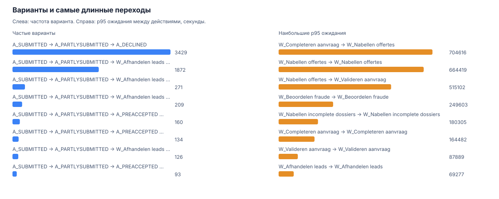
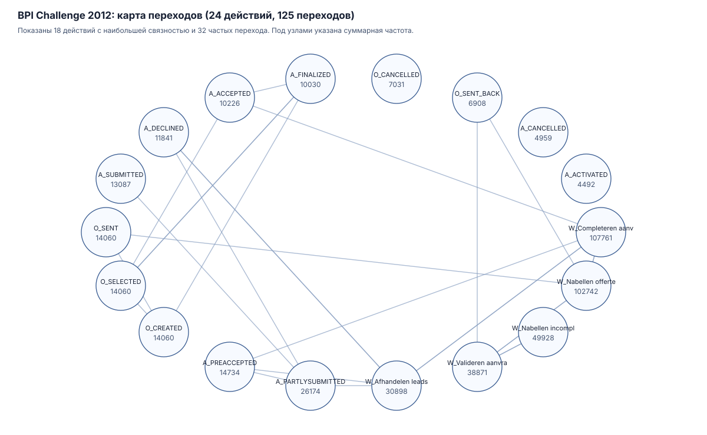

# Анализ процессов и события 1С

Код читает журналы событий в XES, считает варианты, ожидания между действиями и возвраты. Отдельно описан формат событий для будущей выгрузки из 1С.



Алгоритмы проверены на полном открытом журнале BPI Challenge 2012: 262200 событий, 13087 случаев, 24 действия, 4366 вариантов и 125 переходов. Полный анализ занял `10.235` с. Самый большой p95 среди переходов с частотой от 100 – `8.155` суток; это повод разбирать причины, а не диагноз процесса.

BPI – журнал заявок на кредит, не журнал 1С. Для 1С в [контракте событий](onec_export/event-contract.md) отдельно заданы `case_id`, документ и основание, действие, состояние до и после, роль, время и техническая корреляция. Одного журнала регистрации 1С для такого анализа обычно недостаточно.

[Результаты](studies/bpi-challenge-2012-2026-08-10/results.json) · [Источник и хэши](studies/bpi-challenge-2012-2026-08-10/source-manifest.json) · [Методика](docs/study-design.md) · [Повтор прогона](docs/runbook.md)



## Что измерено

- Варианты и переходы строятся по явному `case_id`. Повторный `event_id` с другими данными завершает обработку ошибкой.
- Для вариантов и переходов сохраняются частота, p50, p90 и p95. Повторные действия считаются отдельно от длительности.
- Самый частый вариант служит статистической точкой сравнения. Это не утверждённая BPMN-схема.
- Оценка кандидатов на автоматизацию эвристическая. Она не заменяет расчёт экономического эффекта.

## Локальный API и тесты

```bash
python3.12 -m venv .venv
.venv/bin/python -m pip install -e '.[dev]'
PYTHONPATH=src .venv/bin/python -m pytest -q
PYTHONPATH=src .venv/bin/uvicorn process_mining.api:app
```

API принимает отдельные события через `POST /events`, отдаёт варианты, ожидания, кандидаты и DOT-граф. Он работает в памяти и не является хранилищем журналов компании.

## Границы

- В BPI Challenge 2012 нет данных 1С.
- Сырые записи BPI не распространяются в репозитории. Перед новым скачиванием нужно проверить условия 4TU.
- Псевдонимизация `resource id` не заменяет политику хранения или обезличивания компании.
- Чтобы интерпретировать процесс 1С, нужны дополнительные бизнес-события: причина изменения документа, связь с основанием, роль, состояние и итог проверки.
